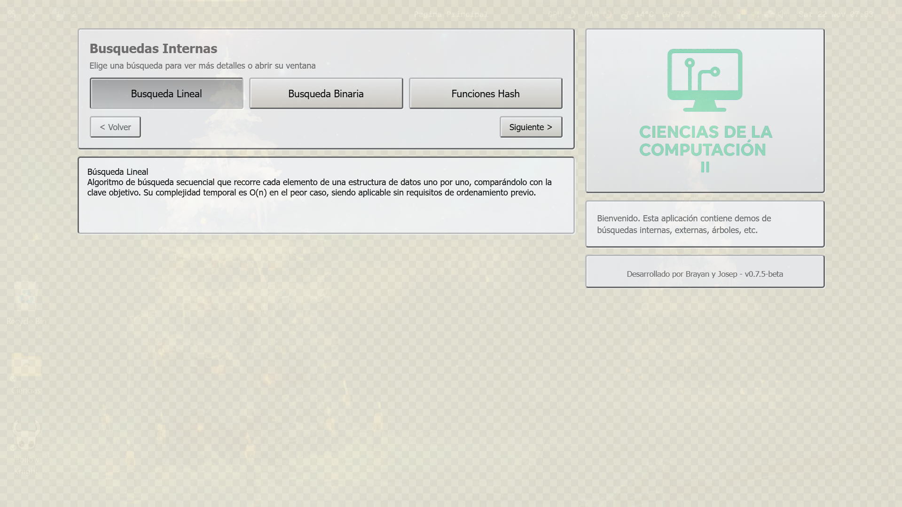

<h1 align="center">🌿 Principal Page - CienciasProject</h1>

<p align="center">
  
</p>

<p align="center">
  <b>Una aplicación moderna construida originalmente en Java y ahora migrada a Electron.</b><br>
  Interfaz limpia, visual elegante y lógica optimizada para una experiencia fluida.
</p>

---

## 🧠 Sobre el proyecto

Aplicacion para la materia de Ciencias de la Computación II usando Electron

---

## 🚀 Características principales

- 🌙 **Interfaz moderna y limpia**  
  Inspirada en el diseño original Java, pero con un estilo más visual y flexible.

- ⚙️ **Migración a Electron**  
  Permite empaquetar la app para Windows, Linux y macOS con soporte nativo.

- 🧩 **Arquitectura modular**  
  Código HTML, CSS y JS organizado por componentes reutilizables.

- 🎨 **Fondo decorativo dinámico**  
  Imagen con opacidad controlada y tamaño adaptable para un efecto visual elegante.

---

## 🖼️ Vista previa

<p align="center">
  
</p>

---

## 🧰 Tecnologías utilizadas

| Tecnología | Descripción |
|-------------|-------------|
| 🟦 **Electron** | Framework para apps de escritorio con tecnologías web |
| 🟨 **JavaScript (ES6+)** | Lógica de la aplicación |
| 🎨 **CSS3** | Estilos modernos y responsivos |
| 🧱 **HTML5** | Estructura base de la interfaz |

---

## 📦 Instalación

```bash
# Clona el repositorio
git clone https://github.com/DrBider-dev/CienciasProject.git

# Entra al directorio del proyecto
cd CienciasProject

# Instala las dependencias
npm install

# Ejecuta la aplicación en modo desarrollo
npm start
